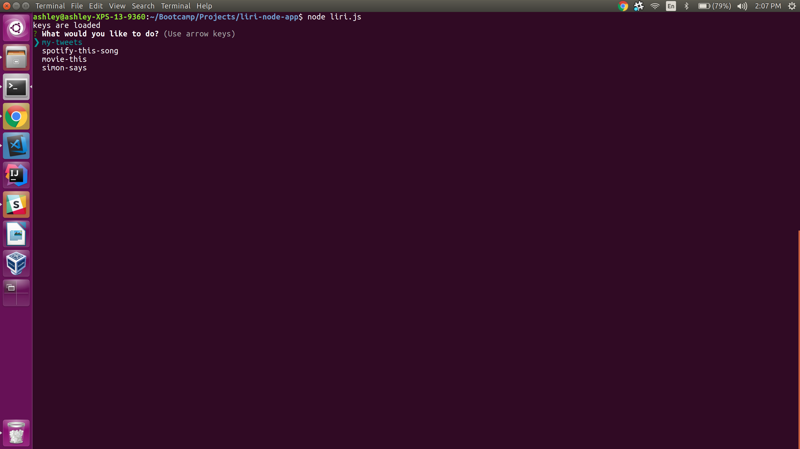
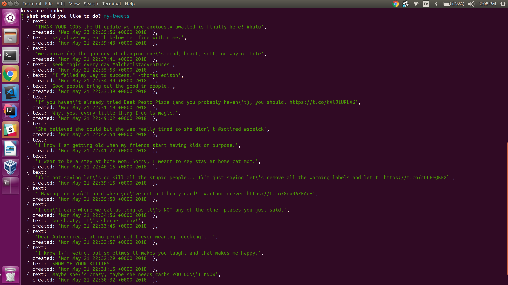
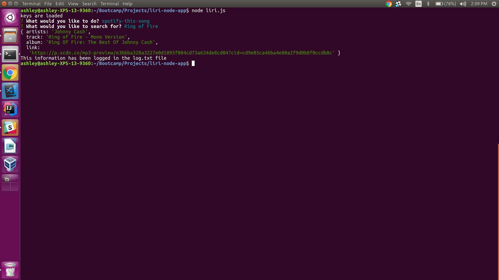
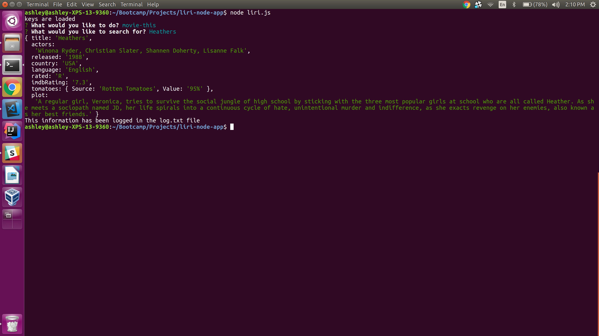
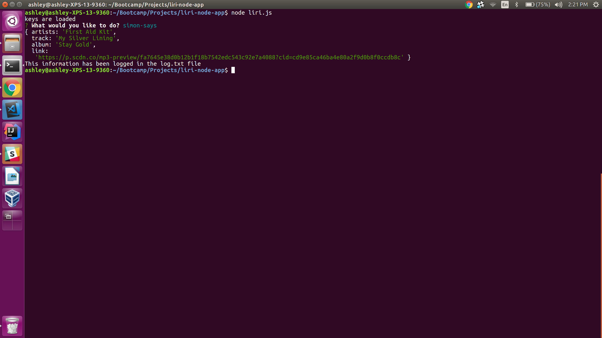

# liri-node-app

*** YOU WILL NEED YOUR OWN SPOTIFY AND TWITTER API KEYS TO RUN THIS APP. ***
1. To run the LIRI node app, start by typing 'node liri' in the command/bash folder. (Make sure you have your own twitter and spotify api keys/id and secret token before running this app)
2. Select what you would like to do from the options menu, you can see my-tweets (my-tweets), find song info (spotify-this-song), find movie info (movie-this), or do what it says (simon-says).

;
;
;
;
;